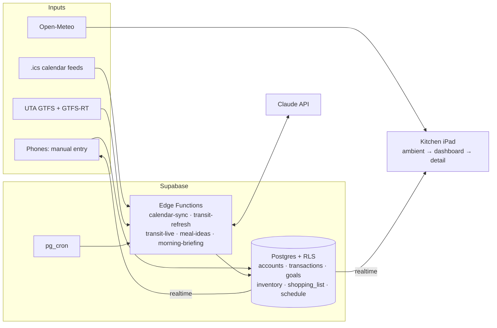

# HUE

**A calm, always-on household dashboard for a kitchen iPad — joint money, kitchen inventory, calendar, and a transit-aware commute nudge on one glanceable surface.**


<!-- Screenshot placeholder — add docs/screenshots/ambient.png -->

---

## Overview

A shared household runs on scattered surfaces: a banking app per login, a notes app for groceries, two calendars, a transit app checked in a hurry at 7:40. HUE pulls the parts that actually belong to the *household* into one place and puts it on the kitchen counter.

The design north star is **whisper, don't shout**. At rest, HUE is a big clock, the weather, one line about what's next, and a single small dot that says whether money is on track — no numbers, nothing to read from across the room. Tap once and it opens into a dashboard; tap a zone and you get the full detail. Real numbers are always one tap away, never in your face.

It runs as a single React web app: the iPad points a browser at it, and both phones open the same app to add transactions or tick off the shopping list, with every screen updating live.

## Key features — and the decisions behind them

### A joint-money model, with accounts as the spine
Most budgeting apps for couples are settle-up ledgers: who paid, who owes whom. HUE deliberately drops all of that — no `paid_by`, no split ratios, no reconciliation between people. The money is one household pool that happens to live in separate bank logins, so HUE models **accounts**, not people.

- Every account (checking, savings, credit card, loan) has a starting balance; every transaction moves money into, out of, or between accounts; **current balances are computed forward** in a Postgres view.
- Four transaction kinds cover everything: `spend`, `income`, `transfer`, and `balance_adjustment` — a signed weekly-reconciliation entry that snaps a computed balance back to bank truth without logging a fake expense.
- Net worth is simply the sum of all balances.

### Credit cards are negative-balance accounts
Treating a card as a liability account turns a classic budgeting headache into a non-issue. A purchase grows the card's (negative) balance. Autopay is a `transfer` from checking to the card: checking goes down, debt goes down, net worth is unchanged. There's no "exclude the card payment so it doesn't double-count" logic, because nothing is double-counted.

### Goals that span accounts
Goals are their own list, linked many-to-many to accounts. A **savings** goal fills toward a target (an emergency fund watching two savings accounts); a **debt-payoff** goal drains toward zero, measured from its starting amount so the percentage is honest.

### Kitchen inventory built for real use
Items are `ok` / `low` / `out`, with an optional loose quantity ("plenty", "half a bag") that is never required — mandatory quantity tracking is what kills inventory apps. The batch editor has one-tap status buttons, add-item, and a **"just restocked"** shortcut that resets everything low/out after a grocery run. Low and out items flow into a **shared shopping list** that both phones check off live at the store. **Meal ideas** come from the Claude API reading what's on hand — "taco night's doable," not a recipe.

### A transit-aware commute nudge
The commute is a two-train trip: UTA's S-Line streetcar into a TRAX connection. A naive "next train" widget is wrong here — a late streetcar can blow the transfer. HUE plans backwards from the arrival time, **protecting the connection**, and turns it into one line: *leave by 7:44*.

- Static timetables come from UTA's **GTFS** feed (refreshed, never hardcoded — schedules change).
- Live delays come from **GTFS-Realtime**, a Protocol Buffers feed decoded in a Supabase Edge Function, so the leave-by time shifts when a train runs late.
- A departure board shows countdowns by destination in both directions.

### Row-Level Security — including the view leak
Every table has RLS: signed-in household members get full access, anonymous callers get nothing. The anon key alone is not a credential.

Along the way this closed a real hole: **Postgres views run as their owner by default**, so the computed views (`account_balances`, `net_worth`, `goal_progress`) would have handed balances to anonymous callers even though the underlying tables were locked down. Setting `security_invoker = on` makes the views run as the caller so the policies apply, and anon's grants on the views are revoked as a second layer. Server-side secrets (the service-role key used by the calendar cron job) live encrypted in Supabase Vault, never inline in a cron command.

### Also on the dashboard
- **Calendar mirror** from published `.ics` feeds, synced on a schedule by an Edge Function + `pg_cron` — read-only by design, no Apple credentials stored anywhere.
- **Weather** from Open-Meteo.
- **Morning briefing** — a short Claude-written paragraph pulling together the day's schedule, weather, and what's low in the kitchen.
- **Coming Up** timeline for packages, flights, and bills.


<!-- Screenshot placeholder — add docs/screenshots/dashboard.png -->

## Tech stack

| Layer | Choice |
| --- | --- |
| Frontend | React 19 + Vite, touch-first CSS (no UI framework) |
| Backend | Supabase — Postgres, Auth, Realtime, Edge Functions (Deno), `pg_cron`, Vault |
| AI | Claude API (meal ideas, morning briefing) via Edge Functions — the API key never reaches the browser |
| Data feeds | UTA GTFS + GTFS-Realtime, published `.ics` calendars, Open-Meteo |
| Devices | Always-on kitchen iPad (ambient display) + two phones (input, shared list) |

## Architecture

**Three-level UI hierarchy**

1. **Ambient** (resting) — clock, date, weather, one money dot, the next thing, a weekday-morning commute pill. Readable from six feet.
2. **Dashboard** (tap to wake) — zones for Today, Kitchen, Money, Coming Up, and the morning briefing.
3. **Detail** (tap a zone) — Money (net worth ring, account tiles, budget bars, goal bars), Kitchen (inventory grid, shopping list, meal ideas), Commute (leave-by, legs, live departures).

**Data flow**



**Data model spine:** `accounts` ← `transactions` (with `to_account_id` for transfers) → computed `account_balances` → `net_worth`; `goals` ↔ `goal_accounts` ↔ `accounts` → `goal_progress`. `categories` + `budget` for spending, `inventory` → `shopping_list` for the kitchen, `schedule` mirrored from calendars.

**Planned pipes:** Plaid (bank transactions), Gmail (package + reservation extraction), and voice (Web Speech API → Claude intent parsing).

## Project structure

```
src/
  components/   screens and zones (AmbientScreen, Dashboard, MoneyScreen, KitchenScreen, CommuteScreen, ...)
  hooks/        data hooks with Supabase realtime subscriptions
  lib/          domain logic — balances, budget, goals, commute planning, briefing
  state/        shared money context
  styles/       design tokens + components
supabase/functions/   Edge Functions (Deno)
hue_v*.sql            schema, RLS, and feature migrations, in version order
docs/                 design brief, project knowledge doc, screenshots
```

## Running it locally

```bash
npm install
cp .env.example .env.local   # add your Supabase URL + anon key
npm run dev
```

Then run the `hue_v*.sql` files in the Supabase SQL editor in version order (v1 schema and RLS first), and deploy the Edge Functions with `npm run deploy:*`. Function secrets (`ANTHROPIC_API_KEY`, `CALENDAR_FEEDS`, `UTA_GTFS_RT_URL`) are set with `supabase secrets set`.

## Status

**Work in progress, in daily use.**

- ✅ **v1 — money engine:** accounts, four transaction kinds, computed balances, net worth, budget, goals, the three-level shell, RLS
- ✅ **v2 — kitchen:** inventory editor, live shared shopping list, Claude meal ideas
- ✅ **v3 — pipes:** calendar mirror, weather, morning briefing, Coming Up timeline, transfer-aware commute with live delays
- ⏭️ **Next:** voice input (inventory flags and questions), Plaid auto-import, Gmail packages and reservations
- 💡 **Later:** Philips Hue lighting control over the local bridge API, idle photo-frame mode

## How it was built

I designed and architected HUE — the product decisions, data model, and UX — and built it with AI-assisted development using Claude Code. Directing AI tooling to ship real, working software is a deliberate part of how I work; the [design docs](docs/) and the commit history show how the decisions and the build evolved.
